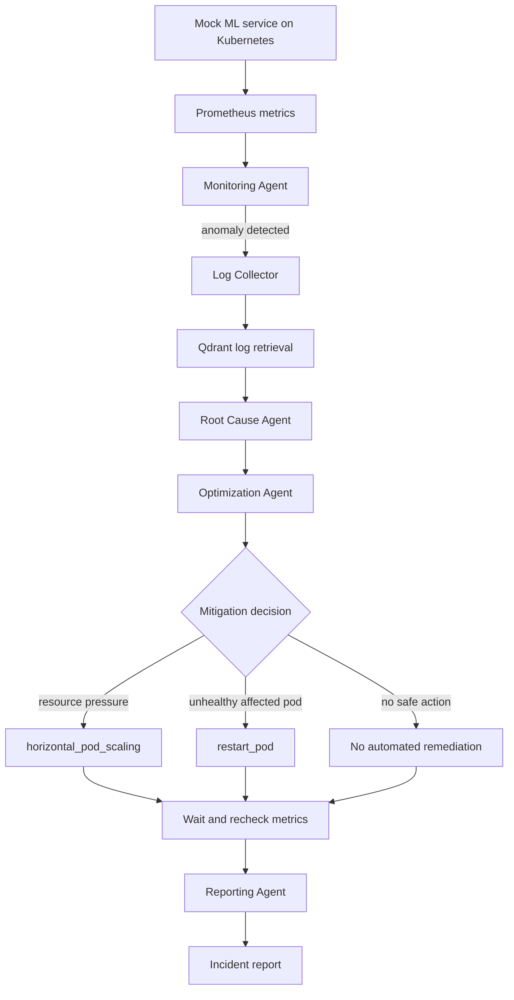

# InfraMind

InfraMind is an experiment in autonomous ML infrastructure management. It watches a live machine learning service running on Kubernetes, detects unhealthy behavior from production-style metrics, investigates the logs behind the anomaly, reasons about the likely root cause, and explains the incident in plain English.

Most monitoring systems stop at alerting that something is wrong. InfraMind tries to close more of the incident loop: it connects metric anomalies to log evidence, identifies the affected Kubernetes pod, chooses whether a safe mitigation is appropriate, and produces a report an on-call engineer can understand without first digging through dashboards.

The project uses a small mock ML inference service as its target workload. The service runs in Kubernetes, exposes Prometheus metrics, and emits application logs. When traffic or runtime behavior causes the service to become unhealthy, InfraMind treats that as a real incident: it reads the live metrics, collects the pod logs, stores logs as embeddings in Qdrant, and asks AI agents to reason over the evidence.

## Pipeline

InfraMind is organized as a LangGraph workflow made of focused agents. The Monitoring Agent watches metrics and detects anomalies. The Log Collector gathers logs from the Kubernetes pod. The Root Cause Agent searches the relevant log evidence, explains the likely cause, and identifies the affected pod. The Optimization Agent decides whether a remediation action is justified. The Reporting Agent turns the final state of the incident into a concise human-readable report.

The remediation layer is intentionally constrained. InfraMind currently supports horizontal pod scaling for workload or resource-pressure issues, and a safe pod restart tool for unhealthy pod or application-failure scenarios. The restart tool acts only on the single affected pod identified during root-cause analysis. It does not restart an entire Deployment, does not delete pods by label selector, and does not list all pods to restart them.

Safety is part of the design. Pod restart actions respect excluded pods labeled `critical=true`, a cooldown window, and a circuit breaker that limits repeated actions. Successful restart actions are recorded so the system can avoid repeatedly applying the same mitigation without evidence that it helped.

The goal of InfraMind is not to replace an engineer, but to test how far an AI-driven incident remediation loop can go when it is grounded in real Kubernetes telemetry, real logs, explicit safety checks, and clear reporting. It is a walking skeleton for autonomous infrastructure operations: detect the problem, collect evidence, reason about cause, take a limited safe action when appropriate, and explain what happened.
