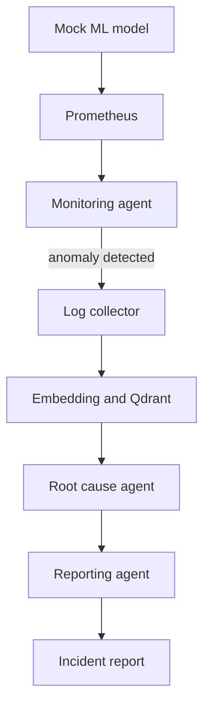

# InfraMind

InfraMind is an experiment in autonomous ML infrastructure management — a system that watches a live machine learning service running in production, notices when something goes wrong, figures out why, and explains it in plain English without a human having to dig through dashboards or log files first.

Most monitoring stacks stop at "something is wrong." InfraMind goes a step further: it tries to close the loop between *detection* and *understanding*. When metrics start looking unhealthy, the system doesn't just fire an alert — it reasons about what changed, pulls the log evidence that best explains the anomaly, and writes up an incident report the way an on-call engineer would, complete with a root cause, supporting evidence, and an honest statement of how confident it actually is.

## The Problem This Solves

Modern ML systems generate a huge amount of operational telemetry — CPU and memory usage, request latency, error rates — but that data on its own doesn't tell you *why* something broke. Usually a human has to correlate a metric spike with the right slice of logs, form a hypothesis, and write it up. That process is slow, repetitive, and easy to get wrong when you're paged at 3am.

InfraMind was built to test whether a foundational AI agent, given the same telemetry and logs a human would have, can do that correlation and diagnosis reliably enough to be useful — and whether it can communicate the result in a way that doesn't require the reader to already understand the system.

The project deliberately starts as a "walking skeleton": a small mock ML model deployed on a real Kubernetes cluster, with real metrics and real logs, and a failure that's deliberately injected rather than waited for. The goal wasn't to build something clever in isolation — it was to prove that the full pipeline, end to end, actually works on a live system before growing it into anything more ambitious.

## What Actually Happens

There's a small machine learning service running inside Kubernetes — a sentiment-analysis model wrapped in a simple API. It behaves like any real inference service: it logs what it's doing, and it exposes metrics that get scraped by Prometheus, the same way a production system would.

To create a genuine failure to diagnose, bad traffic is deliberately sent at the service — the kind of malformed or unusual requests that cause real systems to slow down or throw errors. This isn't a simulated log file with a fake anomaly baked in; it's an actual performance problem happening on an actual running pod, with the metrics and logs reacting exactly as they would in a real incident.

From there, an AI agent takes over. It periodically checks the service's vital signs — how much CPU and memory it's using, how often requests are failing, how long responses are taking — and compares that against sensible operating thresholds. When something crosses the line, the agent doesn't just say "anomaly detected" and stop. It goes and gets the actual application logs from the pod around that time, so it has real evidence to work with rather than guessing.

Because logs can be noisy and it's not obvious which lines actually matter, the system stores logs as embeddings in a vector database and searches for the ones that are semantically closest to the anomaly it just observed. This is the difference between "grep for errors" and actually finding the log entries most likely to explain what happened.

Finally, a reporting agent takes the anomaly and the retrieved evidence and writes an incident report aimed at a person who hasn't looked at any of the raw data. It states plainly what happened, names the most likely root cause, backs that claim up with specific evidence from the logs, and is explicit about its own confidence — including saying so if the evidence doesn't fully support a clean explanation, rather than forcing a connection that isn't really there.

## The Pipeline, End to End

- **Mock ML model** — FastAPI service that serves inference and emits logs and metrics.
- **Prometheus** — scrapes CPU, memory, latency, and error rate.
- **Monitoring agent** — a Groq LLM checks the metrics against operating baselines and flags anomalies.
- **Log collector** — pulls the relevant pod's logs via `kubectl`.
- **Embedding and Qdrant** — logs are embedded and stored as searchable vectors.
- **Root cause agent** — finds the log evidence closest to the anomaly.
- **Reporting agent** — writes a plain-English incident report.
- **Incident report** — summary, root cause, supporting evidence, and confidence level.

## Why It's Built This Way

A few design choices matter here and are worth calling out explicitly:

**The failure is real, not simulated.** Injecting actual bad traffic into a real pod, rather than replaying a canned log file, means the whole pipeline has to work against genuine noise and timing — which is a much more honest test of whether the approach works.

**Detection and diagnosis are separate steps.** The agent that watches metrics isn't the same one that writes the report. Splitting monitoring, evidence retrieval, and reporting into distinct stages makes each piece easier to reason about and means a bad monitoring call doesn't automatically corrupt the final report — the reporting stage is explicitly instructed to say when the evidence *doesn't* support a clear story.

**The system is honest about uncertainty.** The reporting agent is deliberately prompted to distinguish between what the data actually shows and what it's inferring, and to give a confidence level rather than presenting every diagnosis as certain. This matters a lot for something that might eventually sit in front of a real on-call engineer — false confidence is worse than no diagnosis at all.

**Everything is orchestrated as a graph, not a script.** The overall flow — check metrics, decide whether to investigate further, collect logs, store them, hand off to root-cause analysis — is modeled as a state graph with proper conditional routing, so it's straightforward to extend later with more agents (for example, ones that don't just diagnose but actually remediate).

## Where This Is Headed

This walking skeleton is the first step toward a more ambitious system — one where additional agents can propose or even carry out fixes, not just describe them; where alerts arrive by whatever channel an on-call team actually uses; and where the same reasoning extends beyond one mock service to a full ML platform with real model-serving infrastructure behind it. The point of starting small was to make sure the foundational loop — noticing, investigating, and explaining — genuinely works before trusting it with anything bigger.
